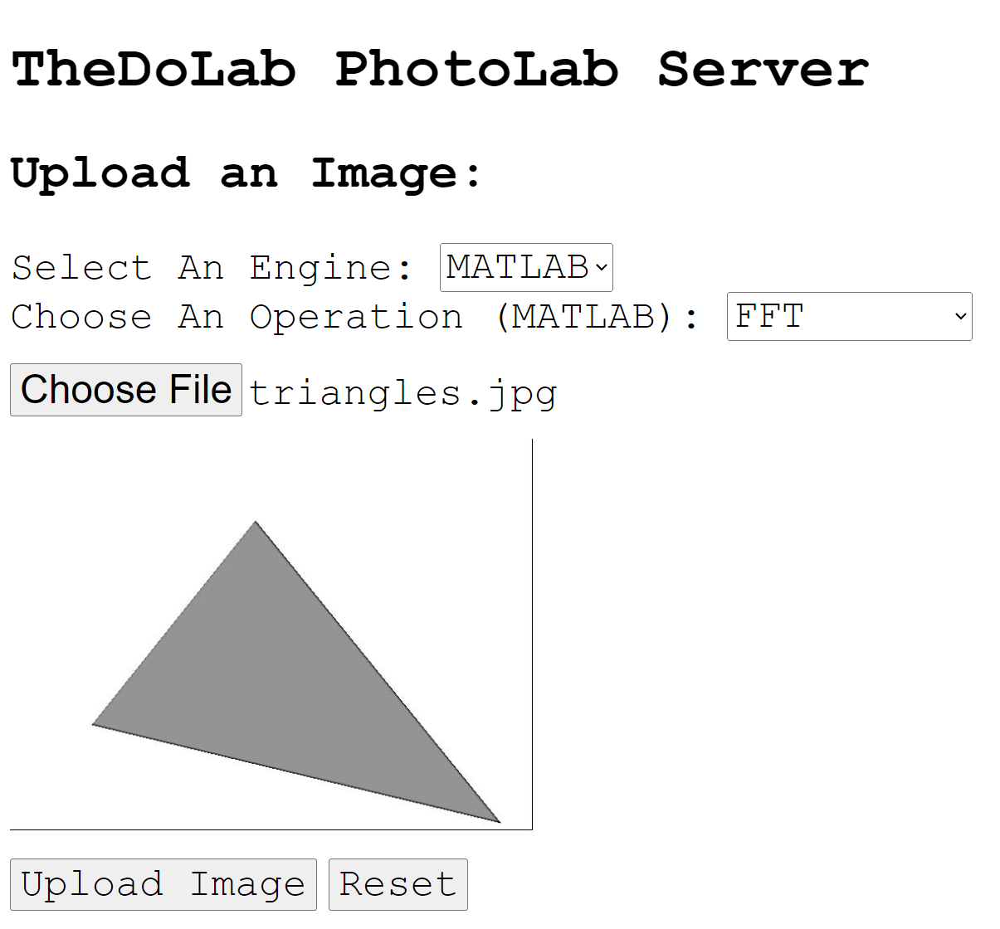
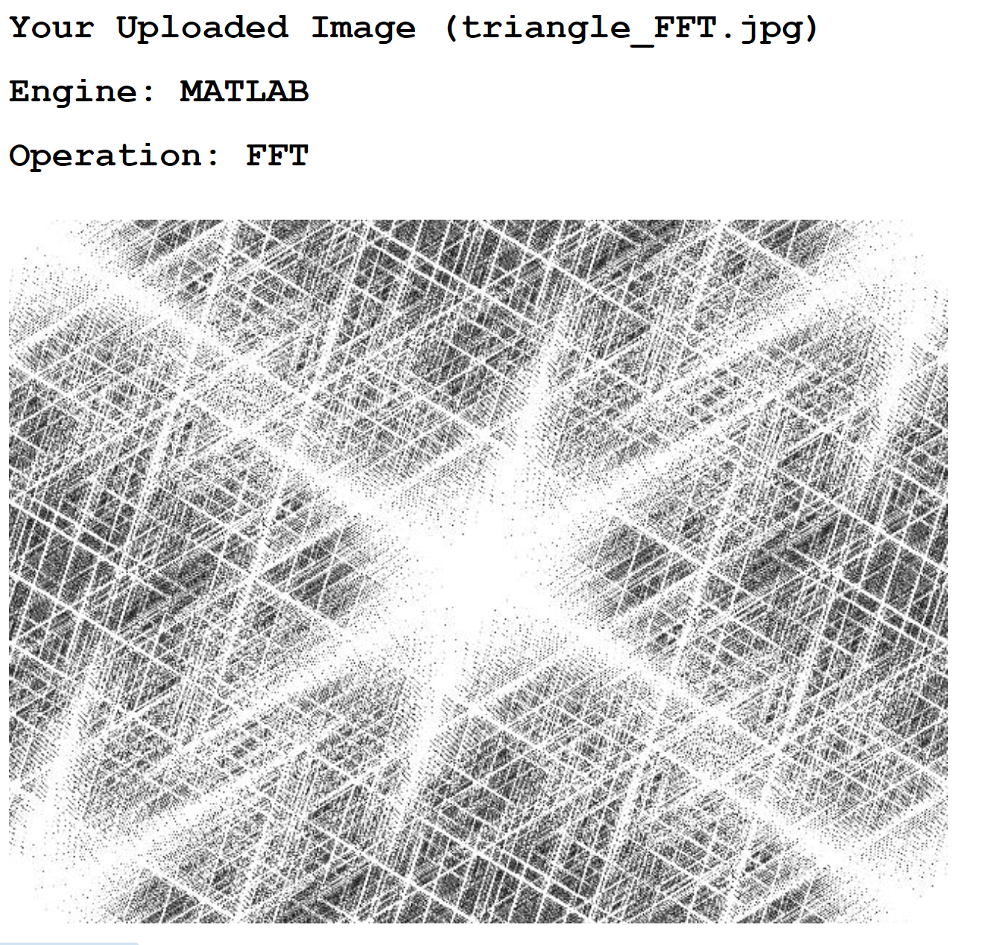

# PhotoLabServer
An Image Processing Web Server, Powered by a Matlab Engine
# Dependencies
[Flask](https://flask.palletsprojects.com/en/2.1.x/): To install, run <code>pip install flask</code>
 
[MATLAB](https://www.mathworks.com/products/matlab.html): Please download Version R2022a or above.
# Usage 
To run, <code>python photolabserver.py</code>
To view the site, go to [localhost](http://localhost) to view it locally. To view it from another device, it is the host ip
# Network Specs
Host: 0.0.0.0
Port: 80 
# GUI

